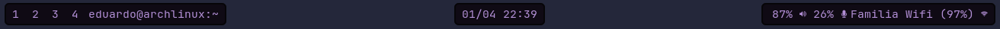
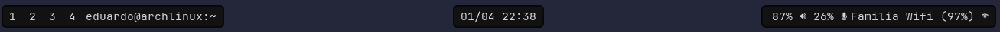

# 51LV3R Theme for waybar
A dark (and light) theme for everyone that love see, now for waybar.


## Dimensions
### Paradise
The light version of the 51LV3R theme, if you love the light themes and don't want that your eyes burn, this theme is for you.

Example:


### Purgatory
The dark and purple version of the 51LV3R theme, if you love the dark side of the moon and a little bit of purple, this theme is for you.

Example:


### Underworld
The darkest version (and the original version) of the 51LV3R theme, if do you love the simplicity and the midnight, this theme is for you.

Example:


## Installation
1. Download the version that do you want in releases page, or give this after coning the repo

2. Move the version that do you have downloaded to your waybar config folder, normally is `~/.config/waybar`

3. Add this code in the start of your `style.css`:

``` css

@import "underworld.css"; /* Change for your choiced version: paradise.css; purgatory.css; underworld.css */

```


## Thanks
A special thanks for <a href="https://github.com/Eduardo-de-Oliveira-Santos">Sr.51LV3R</a> that create this color scheme and port for waybar, and for <a href="https://github.com/51LV3R-Theme">51LV3R Theme</a> to has created this color schemes.
